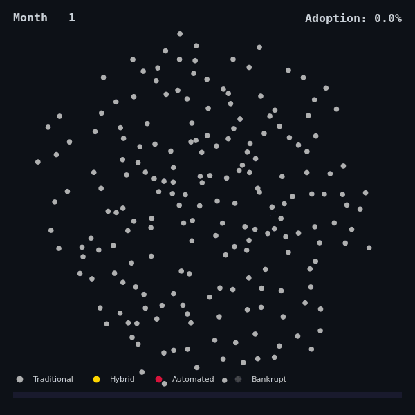

# Complexity Economics

Agent-based modeling of AI-driven labor market transitions. Five papers and 40,000+ Monte Carlo simulations exploring how universal basic income, monetary regimes, and endogenous technology dynamics interact to produce phase transitions in automation adoption.

## Research program

A stock-flow consistent agent-based model (SFC-ABM) with 10,000 heterogeneous firms across 6 sectors, calibrated to the Polish economy (GUS 2024). The series progressively relaxes assumptions — from static parameters to endogenous technology and dynamic networks — testing whether the core finding (a reentrant phase transition at BDP ~500 PLN) survives each extension.

## Methods

- **Agent-based modeling** with stock-flow consistent balance-sheet accounting
- **Phase transitions & critical phenomena** — bifurcation diagrams, susceptibility peaks, critical exponents
- **Finite-size scaling** and data collapse for universality class identification
- **Network science** — Watts-Strogatz, Erdos-Renyi, Barabasi-Albert topologies + endogenous rewiring
- **Empirical estimation** — GMM and hierarchical Bayesian (PyMC) on OECD panel data
- **Factorial experimental design** for mechanism isolation
- **Monte Carlo robustness** — 30–100 seeds per parameter point across multi-dimensional sweeps

## Papers

| # | Repo | Title | Sims | DOI |
|---|------|-------|-----:|-----|
| 1 | [`paper-01-acceleration-paradox`](https://github.com/complexity-econ/paper-01-acceleration-paradox) | The Acceleration Paradox | 6,300 |  |
| 2 | [`paper-02-monetary-regimes`](https://github.com/complexity-econ/paper-02-monetary-regimes) | PLN vs EUR with SGP Constraint | 1,260 |  |
| 3 | [`paper-03-empirical-sigma`](https://github.com/complexity-econ/paper-03-empirical-sigma) | Empirical CES σ Estimation (OECD, GMM + Bayesian) | 120 |  |
| 4 | [`paper-04-phase-diagram`](https://github.com/complexity-econ/paper-04-phase-diagram) | Phase Diagram & Universality | 18,540 |  |
| 5 | [`paper-05-endogenous`](https://github.com/complexity-econ/paper-05-endogenous) | Endogenous Technology & Network Dynamics | 10,080 |  |

**Engine**: [`core`](https://github.com/complexity-econ/core) — reusable Scala 3 SFC-ABM engine (sbt)

## Key findings

- **Acceleration paradox**: moderate UBI *causes* automation rather than responding to it (Paper 1)
- **Monetary sovereignty matters**: PLN float permits the transition; EUR + SGP kills it (Paper 2)
- **σ calibration doesn't**: 5–9× change in elasticity shifts adoption by only 1.5 pp (Paper 3)
- **Topology universality**: BDP_c = 500 PLN across all four network topologies, mean-field γ ≈ 1.0 (Paper 4)
- **Endogenization preserves universality**: reentrant shape survives; BDP_c shifts by at most 250 PLN (Paper 5)

## Stack

- **Simulation**: Scala 3.5.2 (sbt + fat JAR)
- **Analysis**: Python 3 (matplotlib, seaborn, scipy, pandas, PyMC)
- **Papers**: XeLaTeX + biblatex

## License

All repositories are released under the MIT License.
